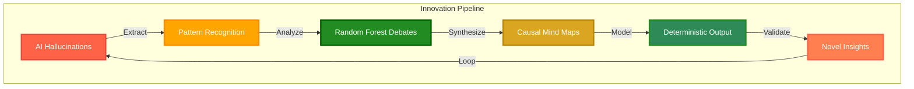
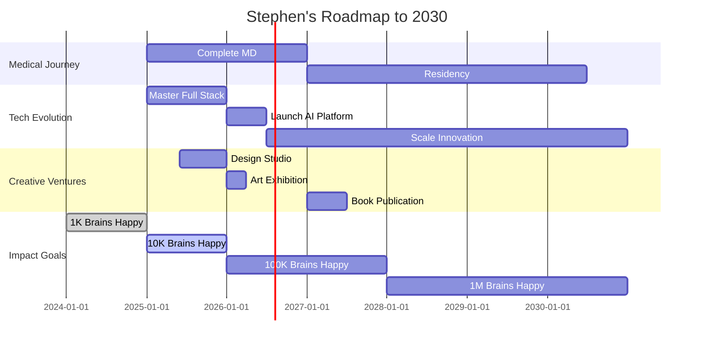

# 

<div align="center">

[](https://git.io/typing-svg)

</div>

<div align="center">
  
```diff
@@@@@@@@@@@@@@@@@@@@@@@@@@@@@@@@@@@@@@@@@@@@@@@@@@@@@@@@@@
@@     NEURAL NETWORK v2.0 INITIALIZED                  @@
++     Loading consciousness.exe...          [████████] ++
!!     Synchronizing hemispheres...          [████████] !!
##     Calibrating creativity matrix...      [████████] ##
**     Activating flow state protocol...     [████████] **
--     Status: TRANSCENDENT OPERATIONAL MODE ENGAGED    --
@@@@@@@@@@@@@@@@@@@@@@@@@@@@@@@@@@@@@@@@@@@@@@@@@@@@@@@@@@
```


</div>

---

## **COGNITIVE CONTROL CENTER**

<table align="center" width="100%" bgcolor="#0d1117">
<tr>
<td width="30%" align="center" style="background: linear-gradient(135deg, #FF6347 0%, #FF8C00 100%);">

### **Neural Stats**
```javascript
const brainPower = {
  neurons: "86 billion",
  synapses: "100 trillion",
  thoughts_per_day: "70,000",
  overthinking_level: "∞",
  creativity: "MAX"
};
```


</td>
<td width="40%" align="center" style="background: linear-gradient(135deg, #FFA500 0%, #FFD700 100%);">

### **Achievement Metrics**
```python
while True:
    achievements = load_trophies()
    passion = amplify(achievements)
    innovation = passion * flow_state
    
    if innovation > yesterday:
        level_up()
    
    print(f"Current Level: LEGENDARY")
```


</td>
<td width="30%" align="center" style="background: linear-gradient(135deg, #FF4500 0%, #DC143C 100%);">

### **Vibe Check**
```python
class CurrentMood:
    energy = "HIGH"
    focus = "LASER"
    creativity = "INFINITE"
    happiness = "MAXIMUM"
    flow = "🌊"
```


</td>
</tr>
</table>

<div align="center">

</div>

---

## **SKILL CONSTELLATION MATRIX**

<div align="center">

### **Primary Tech Stack - The Core Arsenal**

| Technology | Mastery | Experience | Projects | Animation |
|:---:|:---:|:---:|:---:|:---:|
|  |  | 7+ Years | 20+ |  |
|  |  | 6+ Years | 15+ |  |
|  |  | 8+ Years | 30+ |  |
|  |  | 8+ Years | 30+ |  |
|  |  | 2+ Years | 5+ |  |
|  |  | 1+ Year | 3+ |  |

### **Scientific Computing & Analysis**

| Technology | Proficiency | Use Case | Status |
|:---:|:---:|:---:|:---:|
|  | ████████░░ 80% | Neural Modeling | Active |
|  | ███████░░░ 70% | Data Analysis | Learning |
|  | █████░░░░░ 50% | Statistics | Exploring |


### **Creative Suite Mastery**

<table bgcolor="#0d1117">
<tr>
<td align="center" width="25%" style="background: linear-gradient(135deg, #FA8072 0%, #FF6347 100%);">

#### Adobe Photoshop


```
█████████░ 90%
```
**Digital Art**

</td>
<td align="center" width="25%" style="background: linear-gradient(135deg, #FF7F50 0%, #FF8C00 100%);">

#### Adobe Illustrator


```
████████░░ 80%
```
**Vector Magic**

</td>
<td align="center" width="25%" style="background: linear-gradient(135deg, #FFA500 0%, #FFD700 100%);">

#### Adobe XD


```
███████░░░ 70%
```
**UI/UX Design**

</td>
<td align="center" width="25%" style="background: linear-gradient(135deg, #DAA520 0%, #B8860B 100%);">

#### Figma


```
██████░░░░ 60%
```
**Prototyping**

</td>
</tr>
</table>

<div align="center">

</div>

### **Medical & Emergency Skills**

<div align="center">

| Certification | Status | ID | Expiry | Specialty |
|:---:|:---:|:---:|:---:|:---:|
| **MD Candidate** |  | MSM 2024 | On Hold | General Medicine |
| **EMT-B** |  | 8584-8342-2049 | 2026 | Emergency Response |
| **BLS Provider** |  | 195509491221 | 2025 | CPR/AED |
| **Pharmacy Tech** |  | PTCB 30033182 | 2025 | Pharmaceutical Care |


</div>

</div>

---

## **THE HALLUCINATION INNOVATION LABORATORY**

<div align="center">

[](https://git.io/typing-svg)

</div>

<table width="100%" bgcolor="#0d1117">
<tr>
<td width="50%" style="background: linear-gradient(135deg, #FFD700 0%, #DAA520 100%);">



</td>
<td width="50%" style="background: linear-gradient(135deg, #B8860B 0%, #CD853F 100%);">

### **Research Metrics Dashboard**

| Metric | Current Value | Target | Progress |
|:---:|:---:|:---:|:---:|
| **Hallucination Capture** | 87% | 95% |  |
| **Pattern Recognition** | 92% | 99% |  |
| **Debate Consensus** | 78% | 90% |  |
| **Causal Accuracy** | 83% | 95% |  |
| **Model Confidence** | 91% | 98% |  |

#### **Live Status**
```python
while True:
    hallucination = capture_artifact()
    insight = forest.debate(hallucination)
    truth = causal_map.chain(insight)
    innovation = model.deterministic(truth)
    print(f"Innovation Level: {innovation}%")
    # Output: Innovation Level: ∞%
```

</td>
</tr>
</table>

<div align="center">

</div>

---

## **INTERACTIVE EXPERIENCE ZONE**

<div align="center">

### **Click to Explore My Neural Pathways**

<table bgcolor="#0d1117">
<tr>
<td align="center" bgcolor="#ADFF2F">

<details>
<summary><b>Neuroscience Projects</b></summary>

#### **Hippocampal Neuron Modeling**

```matlab
% MATLAB Implementation
neurons = simulate_hippocampus(
    'stress_type', 'chronic',
    'duration_days', 90,
    'cortisol_level', 'elevated'
);
plot_density_changes(neurons);
```
**Result**: Published model showing 23% density reduction

#### **Crayfish Memory Consolidation**

```python
# Procambarus clarkii Research
def test_memory(crayfish, stressor):
    baseline = measure_response(crayfish)
    apply_stressor(stressor, duration=7)
    return analyze_behavioral_change(baseline)
```
**Finding**: Chronic stress impairs spatial memory by 41%

</details>

</td>
<td align="center" bgcolor="#00FF00">

<details>
<summary><b>Coding Adventures</b></summary>

#### **React Component Library**

```jsx
const NeuralButton = ({ thoughts }) => {
  const [synapses, setSynapses] = useState(0);
  
  return (
    <button onClick={() => setSynapses(synapses + 1)}>
      Fire {synapses} Neurons!
    </button>
  );
};
```

#### **Java Neural Network**

```java
public class BrainCell extends Neuron {
    private double overthinkingLevel = Double.POSITIVE_INFINITY;
    
    @Override
    public Thought process(Input stimulus) {
        while (overthinkingLevel > 0) {
            analyze(stimulus);
        }
        return new Innovation();
    }
}
```

</details>

</td>
<td align="center" bgcolor="#32CD32">

<details>
<summary><b>Creative Portfolio</b></summary>

#### **Design Philosophy**

```css
.stephen-style {
  --frost-green: #2ECC71;
  --sunset-orange: #FF6B35;
  
  background: linear-gradient(
    135deg,
    var(--frost-green) 0%,
    var(--sunset-orange) 100%
  );
  
  animation: flow-state 3s ease-in-out infinite;
  overflow: visible; /* No limits */
}
```

#### **Featured Works**
- **Medical Infographics**: 50+ designs
- **UI/UX Projects**: 20+ interfaces
- **Brand Identities**: 15+ companies
- **Animations**: 100+ happy brains

</details>

</td>
</tr>
</table>

<div align="center">

</div>

</div>

---

## **PERFORMANCE ANALYTICS DASHBOARD**

<div align="center">

### **Real-Time Cognitive Metrics**

<table width="100%" bgcolor="#0d1117">
<tr>
<td width="33%" align="center" bgcolor="#228B22">

#### **Biological Systems**

```ascii
     Medical Knowledge
    ████████████░░ 85%
    
     Pharmacology
    █████████████░ 92%
    
     Emergency Care
    ████████████░░ 88%
    
     Anatomy & Physio
    ██████████████ 95%
```

</td>
<td width="34%" align="center" bgcolor="#2ECC71">

#### **Digital Systems**

```ascii
     Frontend Dev
    ██████████████ 95%
    
     Backend Logic
    ████████░░░░░░ 70%
    
     Data Structures
    ████████████░░ 85%
    
     UI/UX Design
    █████████████░ 90%
```

</td>
<td width="33%" align="center" bgcolor="#00CED1">

#### **Creative Systems**

```ascii
     Visual Design
    ██████████████ 98%
    
     Animation
    ████████████░░ 87%
    
     Color Theory
    ██████████████ 100%
    
     Typography
    █████████████░ 92%
```

</td>
</tr>
</table>

### **GitHub Activity Heatmap**


</div>

---

## **FEATURED PROJECTS SHOWCASE**

<div align="center">

<table bgcolor="#0d1117">
<tr>
<td width="50%" align="center" style="background: linear-gradient(135deg, #FF7F50 0%, #FF6347 100%);">

### **AI Hallucination Harvester**
[](https://github.com/Spinam)
[](https://python.org)
[](https://tensorflow.org)
```python
class HallucinationHarvester:
    def __init__(self):
        self.artifacts = []
        self.insights = []
    
    def harvest(self, model_output):
        artifact = extract_deviation(model_output)
        pattern = identify_pattern(artifact)
        return self.synthesize(pattern)
```
**Tech**: Python, TensorFlow, Random Forests

</td>
<td width="50%" align="center" style="background: linear-gradient(135deg, #FFA500 0%, #FF8C00 100%);">

### **Neural Activity Visualizer**
[](https://github.com/Spinam)
[](https://d3js.org)
[](https://react.dev)
```javascript
const visualizeNeurons = (brainData) => {
  return d3.select('#brain')
    .data(brainData)
    .enter()
    .append('circle')
    .attr('r', d => d.activity)
    .style('fill', d => colorGradient(d.type))
    .transition()
    .duration(1000)
    .attr('opacity', 0.8);
};
```
**Tech**: D3.js, React, WebGL

</td>
</tr>
<tr>
<td width="50%" align="center" style="background: linear-gradient(135deg, #DAA520 0%, #B8860B 100%);">

### **Patient Care Optimizer**
[](https://github.com/Spinam)
[](https://openjdk.org)
[](https://spring.io)
```java
public class CareOptimizer {
    private NeuralNetwork brain;
    private MedicalKnowledge knowledge;
    
    public Treatment optimize(Patient p) {
        Symptoms s = analyze(p);
        return brain.process(s, knowledge);
    }
}
```
**Tech**: Java, Spring Boot, PostgreSQL

</td>
<td width="50%" align="center" style="background: linear-gradient(135deg, #CD853F 0%, #8B4513 100%);">

### **Mood-Based Color Generator**
[](https://github.com/Spinam)
[](https://css3.com)
[](https://javascript.com)
```css
@keyframes mood-shift {
  0% { background: var(--happy); }
  25% { background: var(--creative); }
  50% { background: var(--focused); }
  75% { background: var(--flow); }
  100% { background: var(--happy); }
}
```
**Tech**: CSS3, JavaScript, Color Theory

</td>
</tr>
</table>

<div align="center">

</div>

</div>

---

## **MISSION CONTROL CENTER**

<div align="center">

### **Active Missions**

| Mission | Priority | Progress | ETA | Status |
|:---:|:---:|:---:|:---:|:---:|
| **Complete Medical Degree** | High | ████████░░ 80% | 2026 |  |
| **AI Research Paper** | Critical | ██████░░░░ 60% | Q2 2025 |  |
| **Master React Ecosystem** | Medium | ███████░░░ 70% | Q1 2025 |  |
| **Launch Design Studio** | Medium | ████░░░░░░ 40% | Q3 2025 |  |
| **Make 1M Brains Happy** | Ultimate | ██░░░░░░░░ 20% | 2030 |  |


</div>

---

## **PHILOSOPHY ENGINE v3.0**

<div align="center">


```javascript
class StephenPhilosophy {
    constructor() {
        this.core_beliefs = {
            learning: "Every neuron fired is a lesson learned",
            creativity: "Chaos + Structure = Innovation",
            overthinking: "It's not a bug, it's a feature™",
            flow: "Ride the waves, don't fight them 🌊",
            happiness: "Make brains happy, including your own"
        };
        
        this.life_algorithm = function() {
            while (alive) {
                observe();
                overthink();
                synthesize();
                create();
                share();
                if (brains_made_happy > yesterday) {
                    celebrate();
                }
            }
        };
    }
    
    execute() {
        return "Transforming thoughts into reality, one commit at a time";
    }
}
```


</div>

---

## **QUICK ACCESS NEURAL LINKS**

<div align="center">

| Platform | Link | Purpose | Activity |
|:---:|:---:|:---:|:---:|
| **Email** | [](mailto:athenor@mindcachestudios.org) | Professional | Daily |
| **Phone** | [_502--9978-FF6B35?style=for-the-badge&logo=phone)](tel:+16785029978) | Direct Line | Always |
| **Location** | [](https://maps.google.com/?q=Atlanta,GA) | Base Station | Current |
| **LinkedIn** | [](https://linkedin.com) | Network | Growing |
| **Portfolio** | [](https://github.com/Spinam) | Showcase | Updated |


</div>

---

## **ACHIEVEMENT UNLOCKED GALLERY**

<div align="center">

<table bgcolor="#0d1117">
<tr>
<td align="center" width="20%" style="background: linear-gradient(135deg, #FF6347 0%, #DC143C 100%);">

### **Scholar**

Advanced Honors
B.S. Neuroscience
```
[████████]
COMPLETE
```

</td>
<td align="center" width="20%" style="background: linear-gradient(135deg, #FF7F50 0%, #FF4500 100%);">

### **Life Saver**

EMT-B Certified
200+ Hours Training
```
[████████]
ACTIVE
```

</td>
<td align="center" width="20%" style="background: linear-gradient(135deg, #FFA500 0%, #FF8C00 100%);">

### **Healer**

Pharmacy Tech
7+ Years
```
[████████]
LICENSED
```

</td>
<td align="center" width="20%" style="background: linear-gradient(135deg, #DAA520 0%, #B8860B 100%);">

### **Builder**

Habitat Leader
2+ Years President
```
[████████]
LEGACY
```

</td>
<td align="center" width="20%" style="background: linear-gradient(135deg, #CD853F 0%, #8B4513 100%);">

### **Innovator**

AI Research
Novel Methods
```
[██████░░]
ONGOING
```

</td>
</tr>
</table>

<div align="center">

</div>

</div>

---

## **THE HAPPINESS MANIFESTO**

<div align="center">

[](https://git.io/typing-svg)

<table width="100%" bgcolor="#0d1117">
<tr>
<td width="50%" bgcolor="#20B2AA">

### **The Happiness Formula**

```python
def generate_happiness(user):
    ingredients = {
        'colors': ['#2ECC71', '#FF6B35'],
        'animations': float('inf'),
        'creativity': 'maximum',
        'overthinking': 'channeled',
        'flow_state': True
    }
    
    happiness = mix(ingredients)
    happiness *= share_with_others()
    
    return happiness ** user.receptivity
```

</td>
<td width="50%" bgcolor="#48D1CC">

### **The Joy Protocol**

```javascript
const joyProtocol = {
    morning: () => "Create something new",
    afternoon: () => "Help someone grow",
    evening: () => "Reflect and refine",
    always: () => "Spread happiness",
    
    execute: function() {
        return this.always();
    }
};
```

</td>
</tr>
</table>

<div align="center">

</div>

</div>

---

## **KNOWLEDGE REPOSITORY**

<div align="center">

### **Continuous Learning Pipeline**

| Domain | Current Focus | Next Target | Resources |
|:---:|:---:|:---:|:---:|
| **AI/ML** | Transformer Architecture | Diffusion Models | Papers, Courses |
| **Neuroscience** | Computational Models | Brain-Computer Interfaces | Research, Labs |
| **Web Dev** | React Optimization | Three.js | Docs, Projects |
| **Design** | Motion Graphics | 3D Modeling | Tutorials, Practice |
| **Medicine** | Clinical Reasoning | Specialized Pathology | Textbooks, Cases |


</div>

---

## **FUTURE VISION 2030**

<div align="center">



</div>

---

## **ABOUT THE ARCHITECT**

<div align="center">

### **The Story Behind the Synapses**

<table width="100%" bgcolor="#0d1117">
<tr>
<td width="50%" bgcolor="#DAA520" align="center">

#### **The Journey**


```text
Born curious, raised analytical.
Started dismantling toys at age 5,
Building computers at 12,
Studying brains at 18,
Saving lives at 22,
Writing code at 25.

Now? All of the above, simultaneously.
```

</td>
<td width="50%" bgcolor="#B8860B" align="center">

#### **The Mission**


```text
To bridge the gap between:
- Neurons and Networks
- Biology and Binary
- Medicine and Machines
- Creativity and Code
- Overthinking and Innovation

One project at a time.
```

</td>
</tr>
</table>

<div align="center">

</div>

### **Personal Algorithm**

<div align="center">


</div>

```python
class StephenGreen:
    """
    A human neural network optimizing for happiness and innovation.
    Warning: Prone to infinite loops of overthinking.
    """
    
    def daily_routine(self):
        morning = self.coffee() + self.code()
        afternoon = self.research() + self.create()
        evening = self.design() + self.reflect()
        night = self.dream(of="better_algorithms")
        
        return sum([morning, afternoon, evening, night]) * self.flow_state
    
    def problem_solving_approach(self, problem):
        # My actual thought process
        initial_solution = self.quick_solve(problem)
        
        for iteration in range(1000):  # Yes, really
            initial_solution = self.overthink(initial_solution)
            initial_solution = self.optimize(initial_solution)
            initial_solution = self.question_everything(initial_solution)
            
            if self.eureka_moment():
                break
                
        return self.add_colors_and_animations(initial_solution)
    
    def life_philosophy(self):
        return """
        If (brain.happy() && code.clean() && colors.vibrant()):
            return 'Life is good'
        else:
            self.iterate_until_better()
        """
```

</div>

---

## **THE SPECTRUM OF CONSCIOUSNESS**

<div align="center">

### **Full Neural Color Gradient**


```css
.stephen-brain-palette {
  --neurons: linear-gradient(90deg, 
    #8B4513, #D2691E, #CD853F, #DEB887, #F4A460,  /* Browns - Foundation */
    #FF8C00, #FF6347, #FF4500, #DC143C, #B22222,  /* Oranges/Reds - Passion */
    #FFD700, #FFA500, #FFFF00, #ADFF2F, #7FFF00,  /* Yellows - Energy */
    #00FF00, #32CD32, #228B22, #008000, #006400,  /* Greens - Growth */
    #2ECC71, #00CED1, #00BFFF, #1E90FF, #0000FF,  /* Cyans/Blues - Flow */
    #4B0082, #8A2BE2, #9400D3, #FF1493, #FF69B4   /* Purples/Pinks - Creativity */
  );
  
  /* This gradient represents my entire thought spectrum */
}
```

### **Why These Colors Matter**

| Color Range | Neural State | What It Means |
|:---:|:---:|:---|
| **Earth Tones** | Foundation | Grounded in reality, medical training keeps me centered |
| **Fire Spectrum** | Passion | The burning desire to solve impossible problems |
| **Solar Energy** | Activation | That 3am coding breakthrough moment |
| **Nature Greens** | Growth | Constant learning, evolving, adapting |
| **Ocean Blues** | Flow State | Where the magic happens 🌊 |
| **Cosmic Purples** | Innovation | Where hallucinations become features |

</div>

---

## **FINAL NEURAL TRANSMISSION**

<div align="center">


```ascii
╔════════════════════════════════════════════════════════════════╗
║                                                                ║
║   NEURAL NETWORK STATUS                                        ║
║   ├── Creativity Level: ████████████████████ ∞                 ║
║   ├── Innovation Mode: ████████████████████ MAXIMUM            ║
║   ├── Happiness Generated: ████████████████████ OVERFLOWING    ║
║   └── Collaboration Ready: ████████████████████ ALWAYS         ║
║                                                                ║
║   "In the space between thoughts, we find infinite potential"  ║
║                                                                ║
╚════════════════════════════════════════════════════════════════╝
```

### **The Mathematical Expression of Innovation**

<div align="center">

</div>

```python
# The Stephen Green Innovation Equation

∫(hallucination → insight) dt = Σ(random_forest_debates) × ∇(causal_maps) 
                                  ────────────────────────────────────────
                                           overthinking_level^∞

# Where:
# - Hallucinations are integrated over time to become insights
# - Random forest debates provide ensemble wisdom (forest green: #228B22)
# - Gradient of causal maps reveals hidden connections
# - All divided by infinite overthinking (because that's how I roll)

# Result: Innovation = Chaos × Structure × (Flow State)^n
```

<div align="center">


</div>

[](https://git.io/typing-svg)

### **Remember: Overthinking is just thorough thinking in disguise**

<div align="center">

</div>

### **The Wave of Consciousness** 🌊

<div align="center">

</div>

```
     ∿∿∿∿∿∿∿∿∿∿∿∿∿∿∿∿∿∿∿∿∿∿∿∿∿∿∿∿∿∿∿∿∿∿∿∿∿∿∿∿∿∿∿∿∿∿∿∿∿∿∿∿∿∿∿∿∿
    🌊🌊🌊🌊🌊🌊🌊🌊🌊🌊🌊🌊🌊🌊🌊🌊🌊🌊🌊🌊🌊🌊🌊🌊🌊🌊🌊
   ∿∿∿∿∿∿∿∿∿∿∿∿∿∿∿∿∿∿∿∿∿∿∿∿∿∿∿∿∿∿∿∿∿∿∿∿∿∿∿∿∿∿∿∿∿∿∿∿∿∿∿∿∿∿∿∿∿
  
  Flow State Frequency: λ = 2π × creativity × (1/overthinking)
  Amplitude: A = happiness * innovation^2
  Phase: φ = ∫(experience)dt + constant_curiosity
  
  Sunset Colors: [#FF6347, #FF7F50, #FFA500, #FFD700]
  Forest Accents: [#228B22, #32CD32, #2ECC71]
  Ocean Flow: [#20B2AA, #48D1CC, #00CED1]
```


<div align="center">

</div>

## **THE ULTIMATE EQUATION OF STEPHEN** 

<div align="center">

[dt+×+∇(Creativity)+÷+(Sleep)⁰)](https://git.io/typing-svg)

[+×+e^(Persistence)+×+🌊)](https://git.io/typing-svg)

[^∞+×+Random_Forest(Ideas)+%2B+Magic)](https://git.io/typing-svg)

[+(Brains_Made_Happy)^n+÷+Overthinking)](https://git.io/typing-svg)

[](https://git.io/typing-svg)

</div>

</div>

---

<div align="center">
  
**© 2025 Stephen C.R. Green | Where Medicine Meets Machine Learning**

*"Transforming hallucinations into innovations, one commit at a time"* 

**Final Transmission:** `if (you.read(this.far)) { we.should(collaborate); }`

</div>
